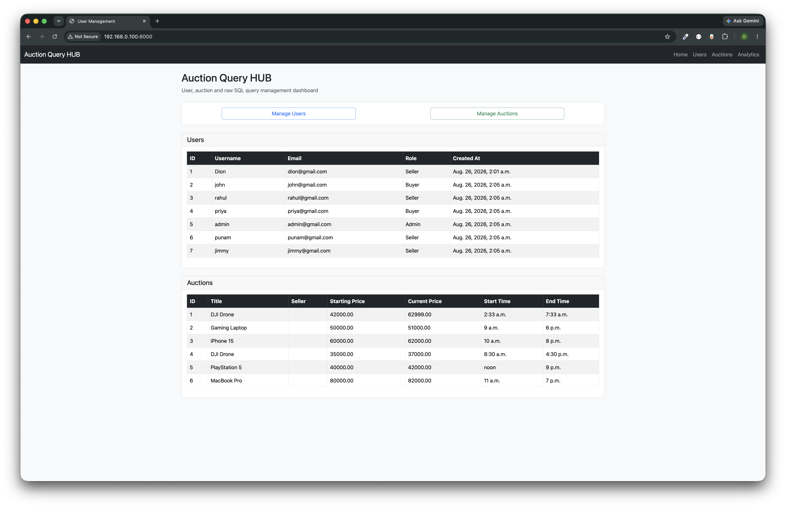
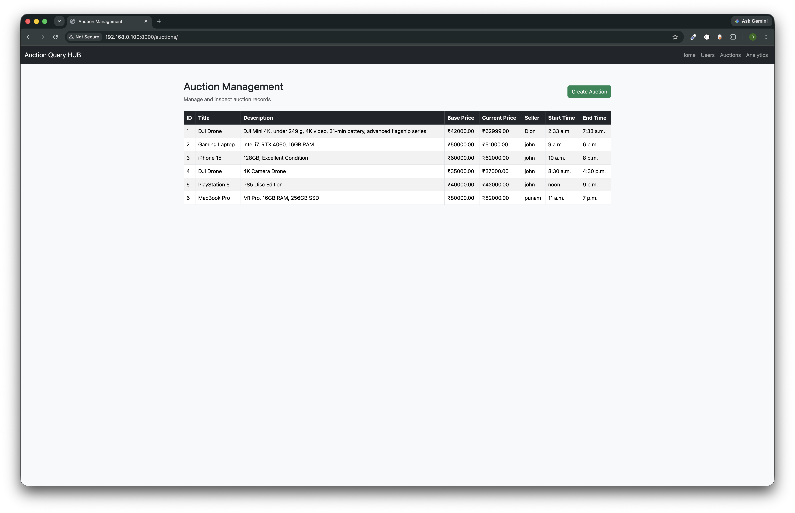
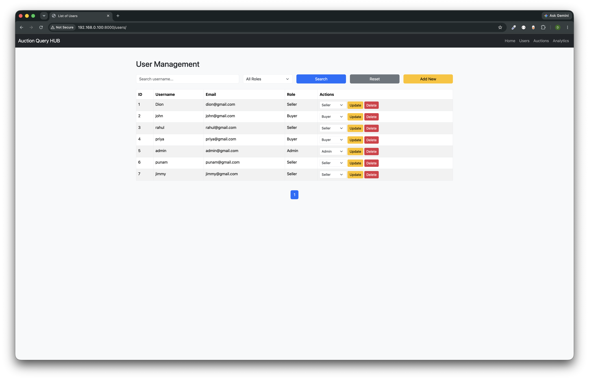
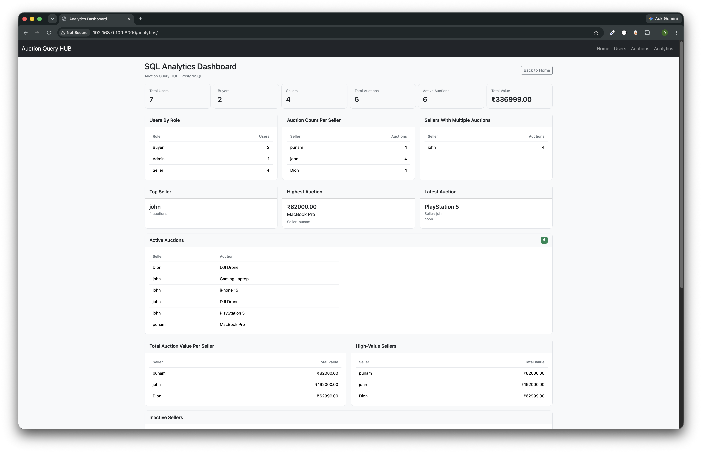
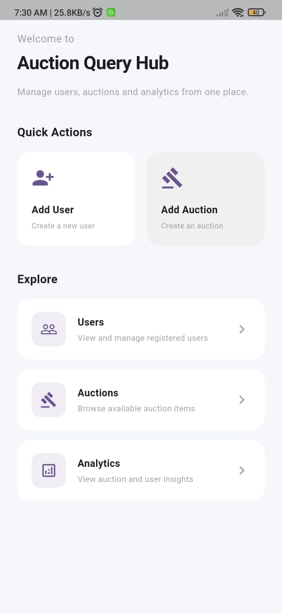
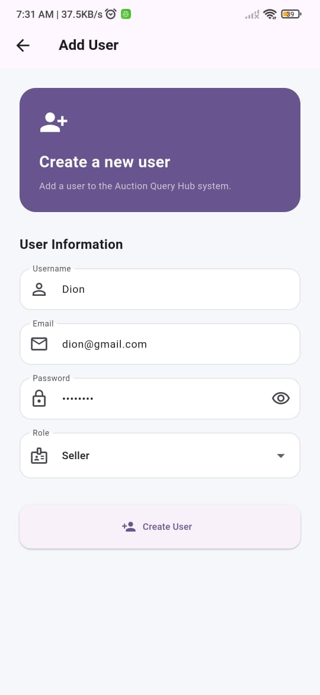
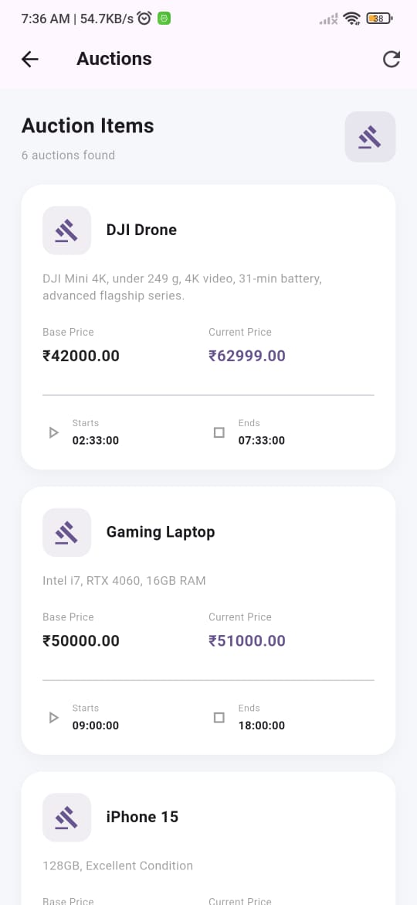
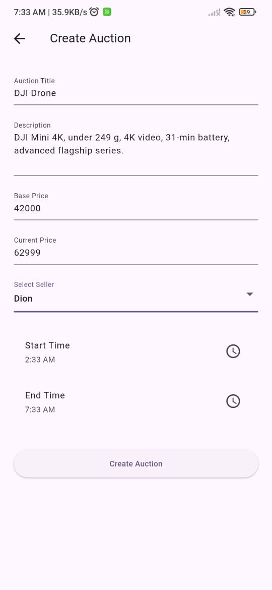
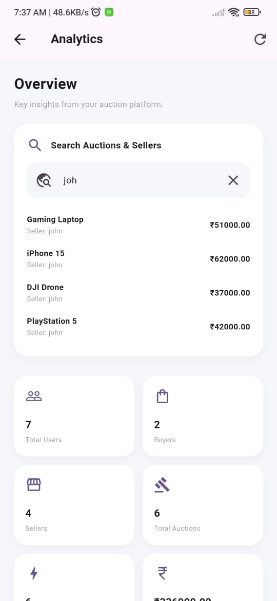

# Auction Query Hub

**Auction Query Hub** is a full-stack online auction management system. It pairs a **Django + Django REST Framework** backend (with a server-rendered web UI and a JSON API) with a cross-platform **Flutter** mobile client, so auctions, buyer/seller/admin accounts, and live analytics can be managed from both a browser and a phone.

The repository is organized as two independent projects that talk to each other over HTTP, plus a shared `assets/` folder for documentation screenshots:

```
auction-query-hub/                     (repo root)
├── assets/
│   ├── django_htmlDOM_templates/      # Web UI screenshots
│   └── mobile_screenshots/            # Flutter app screenshots
├── auction_query_hub/                 # Django backend + web UI
├── auction_query_hub_mobileapp/       # Flutter mobile app
├── .gitignore
└── README.md
```

| Project | Folder | Stack |
|---|---|---|
| Backend + Web UI | [`auction_query_hub/`](#-django-backend--auction_query_hub) | Django, Django REST Framework, SQLite/PostgreSQL |
| Mobile App | [`auction_query_hub_mobileapp/`](#-flutter-mobile-app--auction_query_hub_mobileapp) | Flutter, Dart, `http` |

---

## Table of Contents

- [Features](#features)
- [Django Backend — `auction_query_hub/`](#-django-backend--auction_query_hub)
  - [Project Structure](#django-project-structure)
  - [Setup & Installation](#django-setup--installation)
  - [Environment Variables](#environment-variables)
  - [API Overview](#api-overview)
- [Flutter Mobile App — `auction_query_hub_mobileapp/`](#-flutter-mobile-app--auction_query_hub_mobileapp)
  - [Project Structure](#flutter-project-structure)
  - [Setup & Installation](#flutter-setup--installation)
  - [Connecting the App to the Backend](#connecting-the-app-to-the-backend)
- [Screenshots — Django Web Views](#-screenshots--django-web-views)
- [Screenshots — Flutter Mobile App](#-screenshots--flutter-mobile-app)
- [Tech Stack](#tech-stack)
- [License](#license)

---

## Features

- User management with role-based accounts (**Buyer**, **Seller**, **Admin**)
- Auction creation, listing, and search
- Server-side validation with structured, field-level error responses
- Analytics dashboard summarizing auction and user activity
- Django server-rendered web templates for browser access
- A parallel REST API consumed by the Flutter mobile app
- Native Android/iOS/desktop client built with a single Flutter codebase

---

## 🐍 Django Backend — `auction_query_hub/`

### Django Project Structure

```
auction_query_hub/
│
├── analytics/
│   ├── __pycache__/
│   ├── views/
│   │   ├── __pycache__/
│   │   ├── api_views.py          # REST endpoints for analytics data
│   │   └── views.py              # Server-rendered analytics view
│   ├── __init__.py
│   ├── serializers.py
│   └── urls.py
│
├── auction_query_hub/             # Project-level config
│   ├── __pycache__/
│   ├── __init__.py
│   ├── asgi.py
│   ├── settings.py
│   ├── urls.py
│   └── wsgi.py
│
├── auctions/
│   ├── __pycache__/
│   ├── migrations/
│   ├── views/
│   │   ├── __pycache__/
│   │   ├── api_views.py          # REST endpoints (list/create auctions)
│   │   └── views.py              # Server-rendered auction views
│   ├── __init__.py
│   ├── admin.py
│   ├── apps.py
│   ├── forms.py
│   ├── models.py
│   ├── serializers.py
│   ├── services.py
│   ├── tests.py
│   └── urls.py
│
├── static/
│   ├── css/
│   └── js/
│       └── script.js
│
├── templates/
│   ├── auctions/
│   │   ├── auction_form.html
│   │   └── auction_list.html
│   ├── users/
│   ├── analytics.html
│   ├── base.html
│   ├── home.html
│   └── search_results.html
│
├── users/
│   ├── __pycache__/
│   ├── migrations/
│   ├── views/
│   │   ├── __pycache__/
│   │   ├── api_views.py          # REST endpoints (list/create users)
│   │   └── views.py              # Server-rendered user views
│   ├── __init__.py
│   ├── admin.py
│   ├── apps.py
│   ├── forms.py
│   ├── models.py
│   ├── serializers.py
│   ├── services.py
│   ├── tests.py
│   └── urls.py
│
├── .env                            # Local environment variables (not committed)
├── manage.py
└── Notes.txt
```

> Each app (`users`, `auctions`, `analytics`) follows the same pattern: `views/views.py` serves the HTML templates, `views/api_views.py` exposes the JSON REST endpoints consumed by the Flutter app, and `serializers.py` handles validation and (de)serialization for the API layer.

### Django Setup & Installation

**Prerequisites:** Python 3.10+, pip, and (optionally) PostgreSQL if not using the default SQLite.

```bash
# 1. Clone the repository
git clone https://github.com/DJamesSmith/auction-query-hub.git
cd auction-query-hub/auction_query_hub

# 2. Create and activate a virtual environment
python -m venv venv
source venv/bin/activate        # On Windows: venv\Scripts\activate

# 3. Install dependencies
pip install -r requirements.txt

# 4. Configure environment variables
cp .env.example .env            # then fill in your own values, see below

# 5. Apply migrations
python manage.py migrate

# 6. Create a superuser (for /admin access)
python manage.py createsuperuser

# 7. Run the development server
python manage.py runserver 0.0.0.0:8000
```

The web UI will be available at `http://127.0.0.1:8000/` and the Django admin at `http://127.0.0.1:8000/admin/`.

> **Note:** If a `requirements.txt` isn't present yet in your working copy, generate one from your active environment with `pip freeze > requirements.txt` before committing.

### Environment Variables

Create a `.env` file in `auction_query_hub/` (this file is git-ignored — see `.env.example` for the template to commit instead):

```env
SECRET_KEY=your-django-secret-key
DEBUG=True
ALLOWED_HOSTS=127.0.0.1,localhost,<your-lan-ip>
DATABASE_URL=sqlite:///db.sqlite3
```

- `ALLOWED_HOSTS` must include your machine's LAN IP address (e.g. `192.168.1.5`) if you plan to test the Flutter app on a physical phone connected to the same Wi-Fi network.
- Swap `DATABASE_URL` for a PostgreSQL connection string in production.

### API Overview

All API responses share a common envelope:

```json
{
  "status": "success | error",
  "message": "Human-readable summary",
  "count": 10,
  "data": [ ... ]
}
```

Validation failures return HTTP 400 with field-level detail:

```json
{
  "status": "error",
  "message": "User creation failed.",
  "errors": {
    "username": ["Ensure this field has at least 3 characters."],
    "email": ["This field may not be blank."]
  }
}
```

| Resource | Endpoint | Methods |
|---|---|---|
| Users | `/api/users/` | `GET`, `POST` |
| Auctions | `/api/auctions/` | `GET`, `POST` |
| Analytics | `/api/analytics/` | `GET` |

> Adjust the table above to match your actual `urls.py` route names/prefixes before publishing.

---

## 📱 Flutter Mobile App — `auction_query_hub_mobileapp/`

### Flutter Project Structure

```
auction_query_hub_mobileapp/
├── .art_tool/
├── .idea/
├── android/
├── build/
├── ios/
├── lib/
│   ├── models/
│   │   ├── auction.dart          # Auction data model
│   │   └── user.dart             # User data model
│   ├── utils/
│   │   ├── constants.dart        # API base URL & endpoint constants
│   │   ├── add_user.dart         # Add User form screen
│   │   ├── analytics.dart        # Analytics dashboard screen
│   │   ├── api_service.dart      # HTTP client & error handling
│   │   ├── auction_form.dart     # Create Auction form screen
│   │   ├── auctions_list.dart    # Auctions list screen
│   │   ├── home_screen.dart      # App home / navigation
│   │   └── users_list.dart       # Users list screen
├── linux/
├── macos/
├── test/
├── web/
├── windows/
├── .gitignore
├── .metadata
├── analysis_options.yaml
├── auction_query_hub_mobileapp.iml
├── pubspec.lock
├── pubspec.yaml
└── README.md
```

### Flutter Setup & Installation

**Prerequisites:** [Flutter SDK](https://docs.flutter.dev/get-started/install) (stable channel), Android Studio or Xcode (for device/emulator tooling).

```bash
# 1. Navigate to the mobile app folder
cd auction-query-hub/auction_query_hub_mobileapp

# 2. Fetch dependencies
flutter pub get

# 3. Verify your environment
flutter doctor

# 4. Run on a connected device/emulator
flutter run
```

### Connecting the App to the Backend

Update the base URL in `lib/utils/constants.dart` to point at your running Django server:

```dart
class ApiConstants {
  static const String baseUrl = 'http://<your-machine-lan-ip>:8000/api';
  // e.g. 'http://192.168.1.5:8000/api'
  ...
}
```

- **Android emulator:** use `http://10.0.2.2:8000/api` to reach your host machine.
- **iOS simulator:** use `http://127.0.0.1:8000/api`.
- **Physical device:** use your computer's LAN IP address, and make sure the phone is on the same Wi-Fi network and that IP is listed in the backend's `ALLOWED_HOSTS`.

---

## 🖼 Screenshots — Django Web Views

| Home | Auctions |
|---|---|
|  |  |

| Users | Analytics Dashboard |
|---|---|
|  |  |

---

## 📲 Screenshots — Flutter Mobile App
<table> <tr>
<td align="center"> <br> <sub>Home</sub> </td>
<td align="center"> <br> <sub>Create User</sub> </td> </tr> <tr>
<td align="center"> <br> <sub>Auctions List</sub> </td>
<td align="center"> <br> <sub>Create Auction</sub> </td>
<td align="center"> <br> <sub>Analytics</sub> </td>
</tr> </table>

---

## Tech Stack

**Backend**
- Python, Django, Django REST Framework
- SQLite (dev) / PostgreSQL (prod-ready)
- Django templating for the web UI

**Mobile**
- Flutter & Dart
- `http` package for REST communication
- Material Design widgets

---

## License

This project is licensed under the [MIT License](LICENSE).